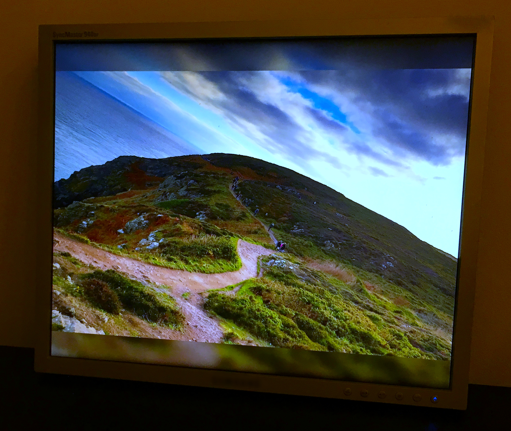

# slide

Simple, lightweight slideshow selecting random images from specified directory. This slideshow is designed to compile and run also on a Raspberry Pi, for example to turn it into a digital picture frame.

Tested versions: 
 * Raspberry Pi 3 running Raspbian Stretch.
 * Raspberry Pi 3 running Raspbian Buster.
 * Raspberry Pi Zero running Raspbian Buster.

Screen background is filled with a scaled version of the image to prevent pure black background.




This project is maintained by myself during my spare time. If you like and use it, consider [buying me a coffee](https://www.buymeacoffee.com/nautilux).

## Usage

```
slide [-t rotation_seconds] [-a aspect] [-o background_opacity(0..255)] [-b blur_radius] [-p image_folder|-i imageFile,...] [-r] [-O overlay_string] [-v] [--verbose] [--stretch]
```

* `image_folder`: where to search for images (.jpg files)
* `-i imageFile,...`: comma delimited list of full paths to image files to display
* `-r` for recursive traversal of `image_folder`
* `-s` for shuffle instead of random image rotation
* `-S` for sorted rotation (files ordered by name, first images then subfolders)
* `rotation_seconds(default=30)`: time until next random image is chosen from the given folder
* `aspect(default=a)`: the required aspect ratio of the picture to display. Valid values are 'a' (all), 'l' (landscape) and 'p' (portrait)
* `background_opacity(default=150)`: opacity of the background filling image between 0 (black background) and 255
* `blur_radius(default=20)`: blur radius of the background filling image
* `-v` or `--verbose`: Verbose debug output when running, plus a thumbnail of the original image in the bottom left of the screen
* `--stretch`: When in aspect mode 'l' or 'p' crop the image rather than leaving a blurred background. For example, in landscape mode this will make images as wide as the screen and crop the top and bottom to fit.
* `-O` is used to create a overlay string.
  * It defines overlays for all four edges in the order `top-left;top-right;bottom-left;bottom-right`
  * All edges overlays are separated by `;`
  * Each edge can either be just a test or contain formatting in the form `margin|fontsize|text`
  * the text can contain special strings which are replaced during rendering:
    * `<time>` current time
    * `<date>` current date
    * `<datetime>` current time and date
    * `<exifdatetime>` time stamp from the EXIF data of the image
    * `<filename>` filename of the current image
    * `<basename>` basename of the current image (without suffix)
    * `<filepath>` filename including the path of the current image
    * `<dir>`directory of the current image
    * `<path>`path to the current image without filename
  * Example: `slide -p ./images -O "20|60|Time: <time>;;;Picture taken at <exifdatetime>"`

## Folder Options file
When using the default or recursive folder mode we support having per folder display options. The options are stored in a file called "options.json" and currently support the following option
```
{
    "fitAspectAxisToWindow": false
}
```
* `fitAspectAxisToWindow` : apply the --stretch option to files in this folder

## Dependencies

* qt5-qmake
* qt5
* qt5-image-formats-plugins
* libexif

Ubuntu/Raspbian:

```
sudo make install-deps-deb
```

## Build

Install dependencies

```
make install-deps-deb
```

Build project

```
make
```

Install binaries

```
sudo make install
```

### macOS

Prerequisite: brew

```
brew install qt5
brew install libexif
brew install libexif
make
```

## Article on using slides

```
This article has more helpful ways that you could use this repo as a picture frame
https://opensource.com/article/19/2/wifi-picture-frame-raspberry-pi
```

## Removing black border (Raspberry Pi)

```
if you find that you have a black border around your screen you can remove it by disabling overscan. This is done by editing /boot/config.txt and uncommenting disable_overscan=1 
```
